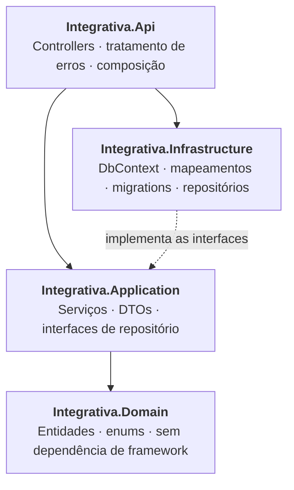
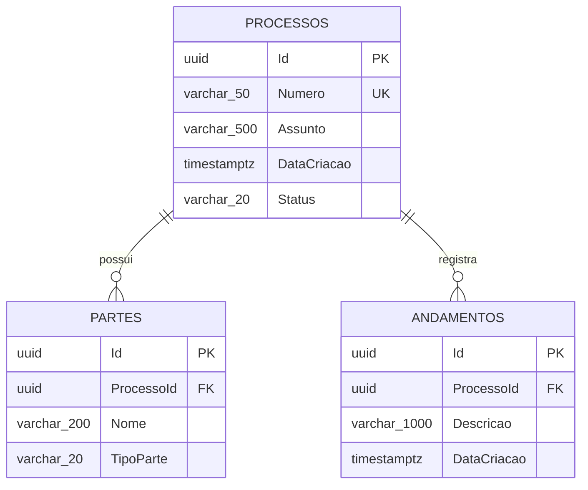

# Sistema de Gestão de Processos — API

API REST para cadastro e acompanhamento de processos (jurídicos, administrativos, etc.), com gestão das **partes envolvidas** (interessadas e contrárias) e do **histórico de andamentos** de cada processo.

Este repositório contém apenas o **backend** (API REST). O frontend consome os endpoints documentados abaixo.


**Índice:** [Tecnologias](#tecnologias-utilizadas) · [Arquitetura](#arquitetura) · [Modelo de dados](#modelo-de-dados) · [Como rodar](#como-rodar-localmente) · [Endpoints](#endpoints) · [Erros e validação](#tratamento-de-erros-e-validação) · [Decisões técnicas](#decisões-técnicas) · [Próximos passos](#status-e-próximos-passos)


## Tecnologias utilizadas

| Camada | Tecnologia |
| --- | --- |
| Linguagem / runtime | C# 14 · .NET 10 (`net10.0`) |
| API | ASP.NET Core Web API (Controllers) |
| ORM | Entity Framework Core 10.0.10 |
| Banco de dados | PostgreSQL (provider `Npgsql.EntityFrameworkCore.PostgreSQL` 10.0.3) |
| Validação | Data Annotations + validação automática do `[ApiController]` |
| Erros | `IExceptionHandler` global + `ProblemDetails` (RFC 7807) |
| Migrations | `Microsoft.EntityFrameworkCore.Design` / `dotnet ef` |


## Arquitetura

Solução em 4 projetos, seguindo separação em camadas (estilo Clean Architecture), com dependências apontando sempre para dentro:



```text
Integrativa-Backend.sln
├── Integrativa.Api
│   ├── Controllers/ProcessosController.cs
│   ├── Errors/GlobalExceptionHandler.cs
│   └── Program.cs
├── Integrativa.Application
│   ├── Common/          # PagedResult, NotFoundException, ConflictException
│   ├── DTOs/            # Requests (com validação) e responses
│   ├── Interfaces/      # IProcessoRepository, IParteRepository, IAndamentoRepository
│   └── Services/        # ProcessoService
├── Integrativa.Domain
│   ├── Entities/        # Processo, Parte, Andamento
│   └── Enums/           # StatusProcesso, TipoParte
└── Integrativa.Infrastructure
    ├── Configurations/  # IEntityTypeConfiguration de cada entidade
    ├── Migrations/
    ├── Persistence/     # AppDbContext
    └── Repositories/    # ProcessoRepository
```

Pontos de destaque:

- **Domínio encapsulado:** `Processo` é um agregado. Setters privados, construção via factory (`Processo.Criar(...)`) e coleções expostas como `IReadOnlyCollection`. Partes e andamentos só entram/saem pelos métodos do agregado (`AdicionarParte`, `RemoverAndamento`, …), então o estado não pode ser corrompido de fora.
- **Repositório por agregado:** o `IProcessoRepository` cuida do agregado inteiro; não há repositório separado gravando partes/andamentos por fora.
- **Leitura x escrita:** consultas de listagem/detalhe projetam direto para DTO com `AsNoTracking()`; a escrita carrega a entidade rastreada com `Include`.


## Modelo de dados



Ambos os relacionamentos usam `ON DELETE CASCADE`: excluir o processo remove suas partes e andamentos.

**processos**

| Coluna | Tipo | Observação |
| --- | --- | --- |
| Id | uuid | PK (gerado na aplicação) |
| Numero | varchar(50) | obrigatório · **índice único** |
| Assunto | varchar(500) | obrigatório |
| DataCriacao | timestamptz | UTC |
| Status | varchar(20) | enum gravado como texto: `Ativo`, `Finalizado`, `Arquivado` |
| DataAlteracao / UsuarioAlteracao | timestamptz / varchar(100) | auditoria |

**partes**

| Coluna | Tipo | Observação |
| --- | --- | --- |
| Id | uuid | PK |
| ProcessoId | uuid | FK → processos (cascade) · indexado |
| Nome | varchar(200) | obrigatório |
| TipoParte | varchar(20) | enum como texto: `Interessada`, `Contraria` |
| DataAlteracao / UsuarioAlteracao | timestamptz / varchar(100) | auditoria |

**andamentos**

| Coluna | Tipo | Observação |
| --- | --- | --- |
| Id | uuid | PK |
| ProcessoId | uuid | FK → processos (cascade) |
| Descricao | varchar(1000) | obrigatório |
| DataCriacao | timestamptz | data do andamento |
| DataAlteracao / UsuarioAlteracao | timestamptz / varchar(100) | auditoria |

Índice composto `(ProcessoId, DataCriacao)` em `andamentos` — a tela de detalhes lista os andamentos **do mais recente para o mais antigo**, e a ordenação já vem do banco.

Enums são persistidos como **string** (não como int): o dump do banco continua legível e reordenar o enum no código não corrompe dados existentes.


## Como rodar localmente

### Pré-requisitos

- [.NET SDK 10.0](https://dotnet.microsoft.com/download) (validado com 10.0.302)
- PostgreSQL 14+ em execução
- Ferramenta `dotnet-ef` (para aplicar as migrations):

```bash
dotnet tool install --global dotnet-ef
# já instalado? atualize: dotnet tool update --global dotnet-ef
```

### 1. Clonar e restaurar dependências

```bash
git clone <url-do-repositorio>
cd Integrativa-Backend
dotnet restore
```

### 2. Criar o banco e o usuário

Os valores abaixo são os mesmos do `appsettings.json` — se usar outros, ajuste a connection string no passo 3.

```sql
CREATE USER integrativa WITH PASSWORD 'integrativa';
CREATE DATABASE integrativa OWNER integrativa;
```

Via `psql`:

```bash
psql -U postgres -c "CREATE USER integrativa WITH PASSWORD 'integrativa';"
psql -U postgres -c "CREATE DATABASE integrativa OWNER integrativa;"
```

Ou, se preferir subir o Postgres em container:

```bash
docker run --name integrativa-db -e POSTGRES_DB=integrativa \
  -e POSTGRES_USER=integrativa -e POSTGRES_PASSWORD=integrativa \
  -p 5432:5432 -d postgres:16
```

### 3. Configurar a connection string

Padrão em `Integrativa.Api/appsettings.json`:

```json
"ConnectionStrings": {
  "Default": "Host=localhost;Port=5432;Database=integrativa;Username=integrativa;Password=integrativa"
}
```

A aplicação **falha no startup** se `ConnectionStrings:Default` não estiver configurada. Em ambiente de desenvolvimento, prefira não versionar credenciais reais — use user-secrets:

```bash
dotnet user-secrets init --project Integrativa.Api
dotnet user-secrets set "ConnectionStrings:Default" "Host=localhost;Port=5432;Database=integrativa;Username=integrativa;Password=SUA_SENHA" --project Integrativa.Api
```

### 4. Aplicar as migrations

O schema é criado pelas migrations do EF Core (as tabelas **não** são criadas automaticamente no startup):

```bash
dotnet ef database update --project Integrativa.Infrastructure --startup-project Integrativa.Api
```

### 5. Rodar a API

```bash
dotnet run --project Integrativa.Api
```

| Perfil | URL |
| --- | --- |
| `http` (padrão) | http://localhost:5122 |
| `https` | https://localhost:7122 (+ http://localhost:5122) |

```bash
# usar o perfil https
dotnet run --project Integrativa.Api --launch-profile https
```

Teste rápido:

```bash
curl http://localhost:5122/api/processos
```

### Comandos úteis

```bash
dotnet build                                    # compila a solução
dotnet ef migrations add <Nome> --project Integrativa.Infrastructure --startup-project Integrativa.Api
dotnet ef database drop  --project Integrativa.Infrastructure --startup-project Integrativa.Api
```


## Endpoints

Base: `/api/processos` · Payloads em JSON.

### Processos

| Método | Rota | Descrição | Sucesso |
| --- | --- | --- | --- |
| `GET` | `/api/processos` | Lista paginada, com filtros | `200` |
| `GET` | `/api/processos/{id}` | Detalhe com partes e andamentos | `200` |
| `POST` | `/api/processos` | Cria processo | `201` + `Location` |
| `PUT` | `/api/processos/{id}` | Atualiza número, assunto e status | `204` |
| `DELETE` | `/api/processos/{id}` | Exclui processo (partes e andamentos em cascata) | `204` |

### Partes

| Método | Rota | Descrição | Sucesso |
| --- | --- | --- | --- |
| `POST` | `/api/processos/{id}/partes` | Vincula parte ao processo | `201` |
| `DELETE` | `/api/processos/{id}/partes/{parteId}` | Remove parte do processo | `204` |

### Andamentos

| Método | Rota | Descrição | Sucesso |
| --- | --- | --- | --- |
| `POST` | `/api/processos/{id}/andamentos` | Adiciona andamento | `201` |
| `DELETE` | `/api/processos/{id}/andamentos/{andamentoId}` | Remove andamento | `204` |

### Filtros e paginação (`GET /api/processos`)

| Query param | Tipo | Padrão | Descrição |
| --- | --- | --- | --- |
| `status` | `Ativo` \| `Finalizado` \| `Arquivado` | — | Filtra por status |
| `numero` | string | — | Busca parcial, case-insensitive (`ILIKE`) |
| `page` | int | `1` | Página (valores < 1 caem para 1) |
| `pageSize` | int | `10` | Itens por página (fora de 1–100 cai para 10) |

Ordenação: processos por `DataCriacao` decrescente.

```bash
curl "http://localhost:5122/api/processos?status=Ativo&numero=0001&page=1&pageSize=10"
```

Resposta:

```json
{
  "items": [
    {
      "id": "9f1c...",
      "numero": "0001234-56.2026.8.26.0100",
      "assunto": "Ação de cobrança",
      "dataCriacao": "2026-08-11T11:48:28Z",
      "status": 0,
      "totalPartes": 2,
      "totalAndamentos": 3,
      "dataAlteracao": "2026-08-11T11:48:28Z",
      "usuarioAlteracao": "Sistema"
    }
  ],
  "page": 1,
  "pageSize": 10,
  "totalItems": 1,
  "totalPages": 1
}
```

### Enums no JSON

No **corpo das requisições e respostas**, os enums trafegam como **número** (comportamento padrão do `System.Text.Json`):

| Campo | Enum | Valor no JSON | Significado |
| --- | --- | :---: | --- |
| `status` | `StatusProcesso` | `0` | Ativo |
| `status` | `StatusProcesso` | `1` | Finalizado |
| `status` | `StatusProcesso` | `2` | Arquivado |
| `tipoParte` | `TipoParte` | `0` | Interessada |
| `tipoParte` | `TipoParte` | `1` | Contraria |

Já na **query string** (`?status=Ativo`) o binding aceita o nome do enum, pois ali quem converte é o model binder e não o serializador JSON.

No banco, os dois enums são gravados como texto (`Ativo`, `Interessada`, …).

### Exemplos

Criar processo:

```bash
curl -X POST http://localhost:5122/api/processos \
  -H "Content-Type: application/json" \
  -d '{"numero":"0001234-56.2026.8.26.0100","assunto":"Ação de cobrança","status":0}'
```

Adicionar parte:

```bash
curl -X POST http://localhost:5122/api/processos/{id}/partes \
  -H "Content-Type: application/json" \
  -d '{"nome":"João da Silva","tipoParte":0}'
```

Adicionar andamento:

```bash
curl -X POST http://localhost:5122/api/processos/{id}/andamentos \
  -H "Content-Type: application/json" \
  -d '{"data":"2026-08-11T14:00:00Z","descricao":"Petição inicial protocolada"}'
```

No detalhe do processo (`GET /api/processos/{id}`), os **andamentos vêm em ordem cronológica decrescente** (mais recente primeiro) e as **partes em ordem alfabética**.


## Tratamento de erros e validação

Todas as respostas de erro seguem o formato `ProblemDetails`:

| Situação | Status | Origem |
| --- | --- | --- |
| Payload inválido (campo obrigatório, tamanho máximo, enum inválido) | `400` | Data Annotations + `[ApiController]` |
| Rota com `id` que não é GUID | `404` | Constraint de rota `{id:guid}` |
| Processo / parte / andamento inexistente | `404` | `NotFoundException` |
| Número de processo duplicado | `409` | `ConflictException` |
| Falha não prevista | `500` | Handler global (loga o stack trace) |

Exemplo de `409`:

```json
{
  "title": "Conflito",
  "status": 409,
  "detail": "Já existe um processo com o número '0001234-56.2026.8.26.0100'.",
  "instance": "/api/processos"
}
```

Regras de validação aplicadas nos requests: `Numero` obrigatório (máx. 50), `Assunto` obrigatório (máx. 500), `Nome` da parte obrigatório (máx. 200), `Descricao` do andamento obrigatória (máx. 1000), `Status`/`TipoParte` validados contra o enum. Além disso, a unicidade do número é garantida tanto na aplicação (`409`) quanto por índice único no banco.


## Decisões técnicas

- **GUID como PK, gerado na aplicação** (`ValueGeneratedNever`): o `Id` já existe antes do `SaveChanges`, o que simplifica montar o agregado inteiro em memória e retornar `201 Created` com o recurso.
- **Datas em UTC** (`timestamptz`, `DateTime.UtcNow`): a conversão para o fuso do usuário fica a cargo do frontend.
- **`AsSplitQuery()` na carga do agregado**: evita a explosão cartesiana ao dar `Include` em partes e andamentos ao mesmo tempo.
- **Campos de auditoria** (`DataAlteracao`, `UsuarioAlteracao`) já preparados para autenticação; hoje o usuário é fixo (`"Sistema"`), pois não há login no escopo do desafio.
- **DTOs como `record`**: imutáveis e com igualdade estrutural, sem expor entidades de domínio pela API.


## Status e próximos passos

Implementado: CRUD de processos, gestão de partes, movimentação de andamentos, paginação e filtros, validação de entrada, tratamento global de erros com status HTTP corretos e migrations do banco.

Ainda não implementado neste repositório:

- Testes automatizados (unitários do `ProcessoService` com repositório fake e de integração da API).
- `Dockerfile` / `docker-compose` para subir API + PostgreSQL em um comando.
- Documentação interativa (OpenAPI/Swagger) — hoje o contrato está descrito neste README.
- Autenticação e preenchimento real de `UsuarioAlteracao`.
- `JsonStringEnumConverter` no pipeline JSON, para que `status` e `tipoParte` trafeguem como texto também no corpo das requisições (hoje só a query string aceita o nome do enum).
- CORS: ainda não há política configurada no `Program.cs`, então um frontend em outra origem será bloqueado pelo navegador.
